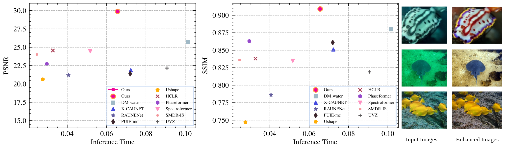

# TSUIE: Efficient Two-Stage Underwater Image Enhancement Framework

The official implementation of [**TSUIE: Efficient two-stage underwater image enhancement framework**](https://www.sciencedirect.com/science/article/pii/S0925231226006818?via%3Dihub)

## Overview



## Project Structure

```
TSUIE_code/
├── TSUIE_test.py              # Main testing/inference script
├── models/
│   ├── Diffusion/             
│   │   ├── diffusion.py
│   │   └── Unet.py
│   └── FENet/                 
│       ├── FusionEnhance.py   
│       ├── network.py         
│       └── loss.py
├── data/                      # Dataset & dataloader
│   ├── data.py
│   └── dataset.py
├── eval/                      # Evaluation metrics
│   ├── ssim_psnr.py
│   ├── pcqi.py
│   └── deltaE.py
└── checkpoint/                # Pre-trained weights
    ├── Diffusion.pth
    └── FENet.pth
```

## Requirements

```
- Python 3.8+
- PyTorch
- torchvision
- OpenCV
- tqdm
- einops
- pytorch_wavelets
```

## Usage

### Testing

```bash
python TSUIE_test.py \
    --device cuda:0 \
    --data_test_dataset /path/to/test/images/ \
    --output output/
```

### Evaluation

```bash
python eval/ssim_psnr.py
```

Computes PSNR, SSIM, PCQI, MSE, and DeltaE (CIEDE2000) between enhanced outputs and reference images.

## Citation

This project is for research purposes only.

```
@article{CHEN2026133284,
title = {TSUIE: Efficient two-stage underwater image enhancement framework},
journal = {Neurocomputing},
volume = {680},
pages = {133284},
year = {2026},
issn = {0925-2312},
}
```

